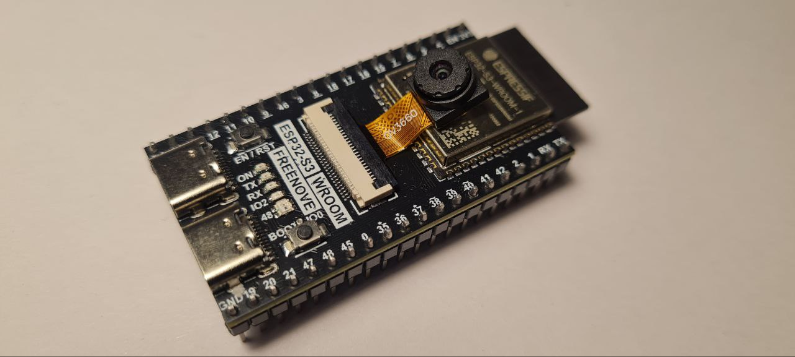

# ESP32-S3 Cam (Freenove, OV3660) — Universal FW

Прошивка для **ESP32‑S3 WROOM (Freenove)** с камерой **OV3660**:
- MJPEG-стрим по HTTP (без блокировок и таймеров).
- Конфиг хранится в **NVS** (`namespace "cfg"`): Wi-Fi + разрешение, FPS, яркость LED.
- Управление через **UART 115200 8-N-1** набором текстовых команд.
- Простая стартовая страница по `/`, сам стрим по `/stream` (multipart MJPEG).
- Светодиод **GPIO2** используется как «вспышка».


---

## Аппаратная база

- **Плата:** Freenove ESP32-S3 WROOM (встроенная **OPI PSRAM 8 MB**).
- **Камера:** OV3660 (DVP, 8-бит шина).


| Сигнал | GPIO | Примечание |
|:--|--:|:--|
| XCLK | **15** | тактирование матрицы (LEDC TIMER_0) |
| PCLK | **13** | пиксельный такт |
| VSYNC | **6** | вертикальная синхронизация |
| HREF | **7** | строковая синхронизация |
| SIOD (SDA) | **4** | SCCB/I²C (управление сенсором) |
| SIOC (SCL) | **5** | SCCB/I²C |
| D0..D7 | **11, 9, 8, 10, 12, 18, 17, 16** | параллельные данные D0→D7 |
| PWDN | `-1` | не используется |
| RESET | `-1` | не используется |
| LED (flash) | **2** | ШИМ через LEDC TIMER_2 |


---

## Быстрый старт (Arduino IDE)

1. **Board:** `ESP32S3 Dev Module`  
2. **PSRAM:** `OPI PSRAM`  
3. **Flash Size:** по модулю (обычно `8MB`)   
4. **Serial Monitor:** `115200`

После прошивки откройте монитор порта. Если Wi-Fi не задан:
```
SETWIFI|MySSID|MyPass
```
Далее откройте в браузере `http://<IP>/` или напрямую `http://<IP>/stream`.

---

## UART команды (каждая заканчивается CR/LF)

**Скорость:** `115200 8-N-1` — **ответы:** `OK` / `ERR` + периодические `STATUS|...`

### Wi-Fi и общий сброс
```
SETWIFI|<ssid>|<pass>     # сохранить сеть в NVS и подключиться
RESETCFG                   # стереть все ключи NVS и перезагрузиться
```

### Видео‑настройки
```
SETRES|QQVGA|QVGA|HVGA|VGA|SVGA|XGA|SXGA|UXGA
SETFPS|<1-30>
```

### LED («вспышка» GPIO2)
```
FLASH|<0-100>             # постоянная яркость в процентах (0..100)
BLINK|<ms>                # одиночная вспышка на <ms> миллисекунд (100%)
```

### Статус (каждые ~2 с)
```
STATUS|IP=<ip>            # есть подключение и IP
STATUS|ERR=NO_WIFI        # точка недоступна / неверный пароль
STATUS|ERR=NO_IP          # DHCP не выдал адрес
STATUS|ERR=NO_CFG         # SSID/PASS не заданы
STATUS|ERR=CAM            # ошибка инициализации камеры
STATUS|CAM=OK             # камера успешно инициализировалась (однократно)
```

---

## Сетевой интерфейс

- `GET /` — простая HTML‑страница с ``
- `GET /stream` — **multipart/x-mixed-replace** MJPEG поток (`boundary=frame`)


> Поток рассчитан на **одного клиента**. При отключении клиента соединение закрывается и принимается следующий.

---

## Сохранение настроек (NVS)

**Namespace:** `cfg`  
**Ключи:**
- `ssid` (string) — имя сети
- `pass` (string) — пароль
- `res`  (uchar, `framesize_t`)
- `fps`  (uchar, 1..30)
- `flash`(uchar, 0..100)

**RESETCFG** удаляет все ключи из `cfg` и выполняет `ESP.restart()`.

---

## «Свободные» пины и особенности (для своих задач)


### Используются прошивкой
`GPIO2,4,5,6,7,8,9,10,11,12,13,15,16,17,18` — (камера + LED). Их не трогаем.

### Зарезервированы SoC / платы
- **GPIO26…GPIO32** — шина **SPI0/1** флеша/PSRAM внутри модуля → **не использовать**.  
- **Страп-пины:** **GPIO0, GPIO3, GPIO45, GPIO46** — участвуют в выборе режима загрузки и других конфигураций; **избегайте активных сигналов на старте**.  
- **USB:** **GPIO19 (D-), GPIO20 (D+)** — заняты, если включён **USB-CDC/JTAG** или **USB-OTG**; на старте возможны короткие импульсы. Если USB-режим отключён, их можно вернуть в GPIO, но учитывайте это при прошивке/отладке.  

### Рекомендуемые кандидаты (если выведены на плате)
- **`1, 14, 21, 38, 39, 40, 41, 42, 47, 48`** — свободны (PWM/I²S/I²C/SPI и т. п.).


### Аналоговый вход (ADC) и Wi‑Fi
- У **классического ESP32** блок **ADC2** конфликтует с Wi-Fi: при активном Wi‑Fi чтение с ADC2 обычно невозможно.  
- На **ESP32-S3** ситуация лучше, однако в некоторых фреймворках/библиотеках до сих пор встречаются ограничения и предупреждения, унаследованные от ESP32.  

### Прочие нюансы GPIO
- У S3 **нет «вечно input-only» GPIO**, как у старого ESP32 — но **strap-пины** всё равно ведут себя особым образом на старте, а **USB D±** захватываются подсистемой USB при её включении.  
- **JTAG по USB** (CDC/JTAG) использует **GPIO19/20**; для внешнего JTAG возможны другие пины, но по умолчанию используется встроенный USB‑JTAG.  

---

## Значения по умолчанию

- `RES = QVGA (320×240)`  
- `FPS = 10`  
- `FLASH (LED) = 0%`  
- `XCLK = 20 MHz` (при проблемах попробуйте 10 MHz)

---

## Примеры обмена по UART

```
> SETWIFI|RobotX|s3cret
< OK
... (через ~2 c)
< STATUS|IP=192.168.0.134

> SETRES|VGA
< OK

> SETFPS|15
< OK

> FLASH|30
< OK

> BLINK|200
< OK
```

---

## Где что в коде

- **`initCamera()`** — конфигурация камеры (пины, XCLK, буферы, твики сенсора).  
- **`ledcInit()` / `setLedDuty()`** — PWM на GPIO2 (**LEDC TIMER_2**).  
- **`serviceHttp()`** — роутинг `/` и `/stream`, отправка 1 кадра за итерацию.  
- **`handleUart()`** — парсер UART‑команд и запись в NVS.  
- **`sendStatus()`** — статус каждые ~2 с.  
- **`setup()`** — порядок инициализации (**камера → LED → Wi‑Fi/HTTP**).

